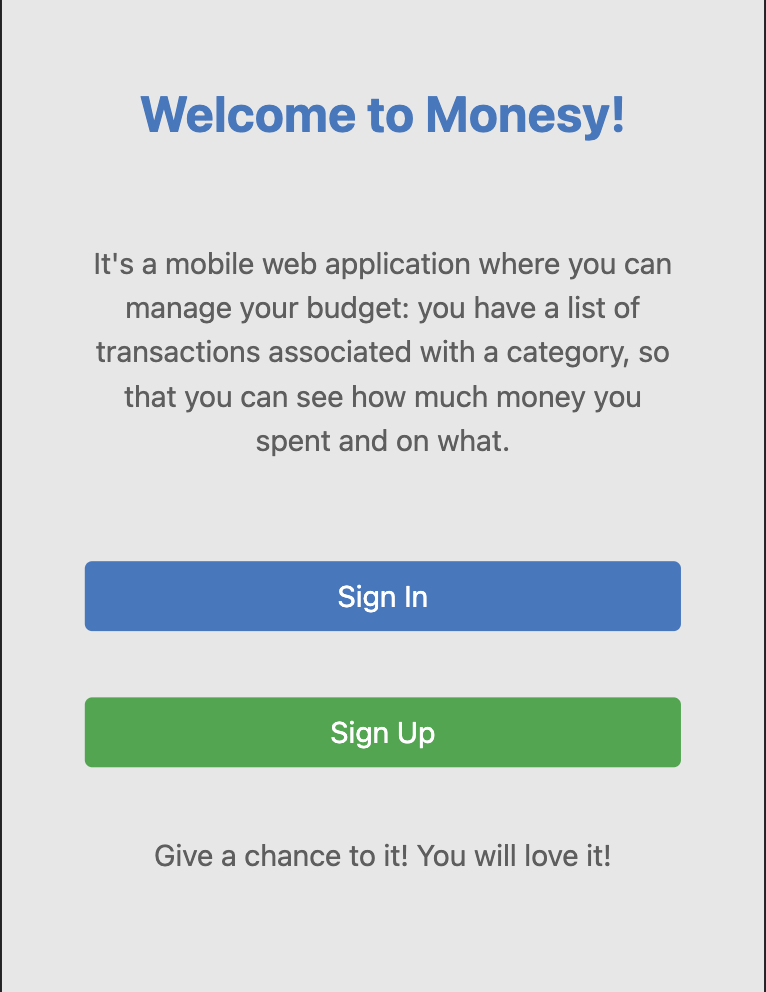

# RoR Capstone Project: Monesy

> A mobile web application where you can manage your budget: you have a list of transactions associated with a category, so that you can see how much money you spent and on what.



> Informative video about the application: [Demo-Video](https://www.loom.com/share/03f3569582f0456d8b0b284772a59e4c)

## Built With

Ruby >= 3.0.0

Rails >= 7.0.0

Postgresql >= 12.0

## Getting Started

- To get a local copy of the repository please run the following commands on your terminal:
   ```
   git clone https://github.com/ramiaquista/budget-app
   ```
- Go to the cloned directory with `cd budget-app`
- Run `bundle install` to install the necessary packages
- Install the `postgresql` database and all necessary dependencies (if you are on Ubuntu just run `sudo apt install postgresql postgresql-contrib`)
- Run `rails db:create` to create the database locally or if already have one with the same name run `rails db:reset` instead
- After installing everything, you can run now the website with `rails s`

## Running linters
- Rubocop (Ruby code linter)
```
rubocop
```
- Stylelint (CSS linter)
```
npx stylelint "**/*.{css,scss}"
```

## Testing
- Using RSpec and Capybara
``` 
rspec spec/
```

## Authors

👤 **Ramiro Aquistapace**

- GitHub: [@ramiaquista](https://github.com/ramiaquista)
- Twitter: [@ramiaq1](https://twitter.com/ramiaq1)
- LinkedIn: [RamiroAquistapace](https://www.linkedin.com/in/ramiro-aquistapace-32b61b204/)

## 🤝 Contributing

Contributions, issues, and feature requests are welcome!

Feel free to check the [issues page](../../issues/).

## Show your support

Give a ⭐️ if you like this project!

## Acknowledgments

- Microverse

## 📝 License

This project is [MIT](./LICENSE) licensed.